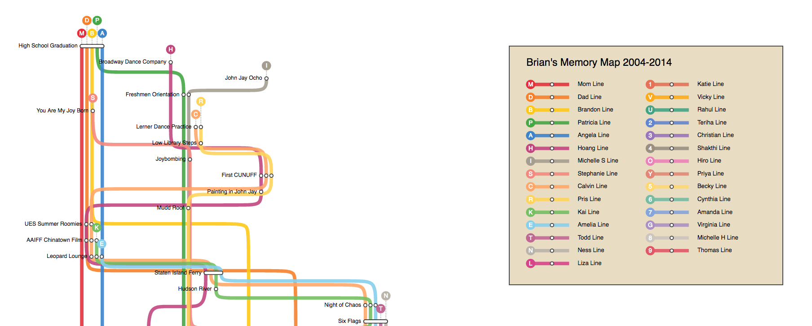

# D3 tube map

D3 implementation of tube map. Component extracted from [beefoo/memory-underground](https://github.com/beefoo/memory-underground). All credits go to @beefoo.

## TODO

- remove jquery dependency
- remove underscore dependency
- update D3
- use D3 [pan zoom](https://bl.ocks.org/mbostock/7ec977c95910dd026812) instead of jquery plugin (or simple [d3.zoom](https://coderwall.com/p/psogia/simplest-way-to-add-zoom-pan-on-d3-js))
- clean up code and document options
- implement as separate module and publish as npm package

## Other implemetations

- [d3-tube-map](https://github.com/johnwalley/d3-tube-map)
- [Visualizing London Tube map](https://bl.ocks.org/nicola/69730fc4180246b0d56d)
- [Visualizing Voronoi diagram of London Tubemap](https://github.com/nicola/tubemaps/tree/master/examples/voronoi)
- [travel-time-tube-d3](https://randometc.github.io/travel-time-tube-d3/)

## Development

```sh
git clone https://github.com/stereobooster/d3-tube.git
cd d3-tube
yarn or npm install
npm start
```

### Deployment: GitHub Pages

```sh
npm run deploy
```
